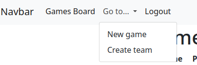
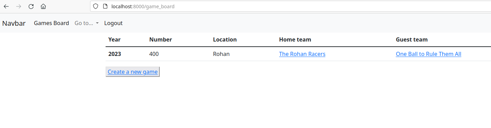
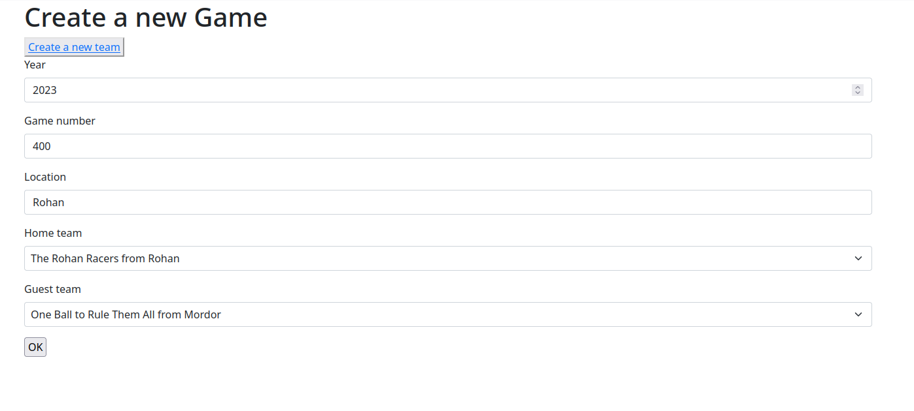
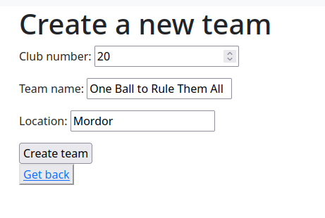
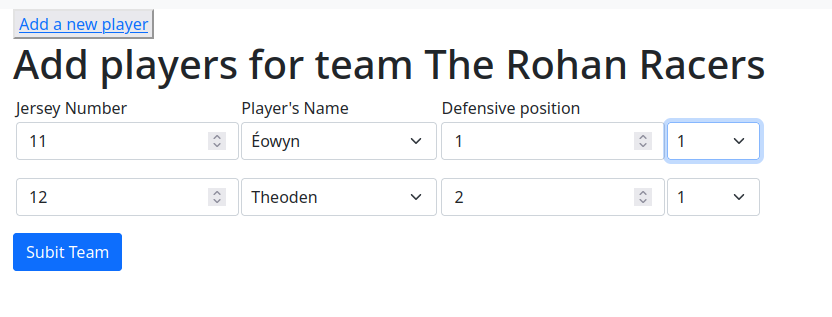
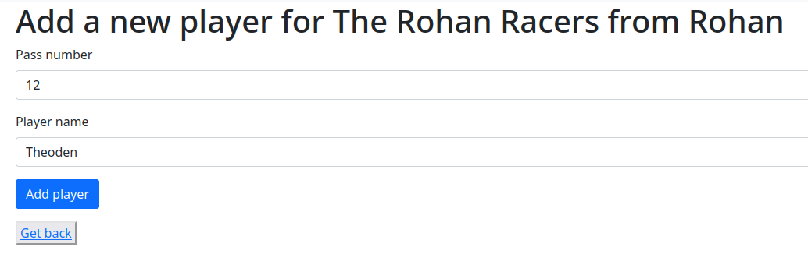
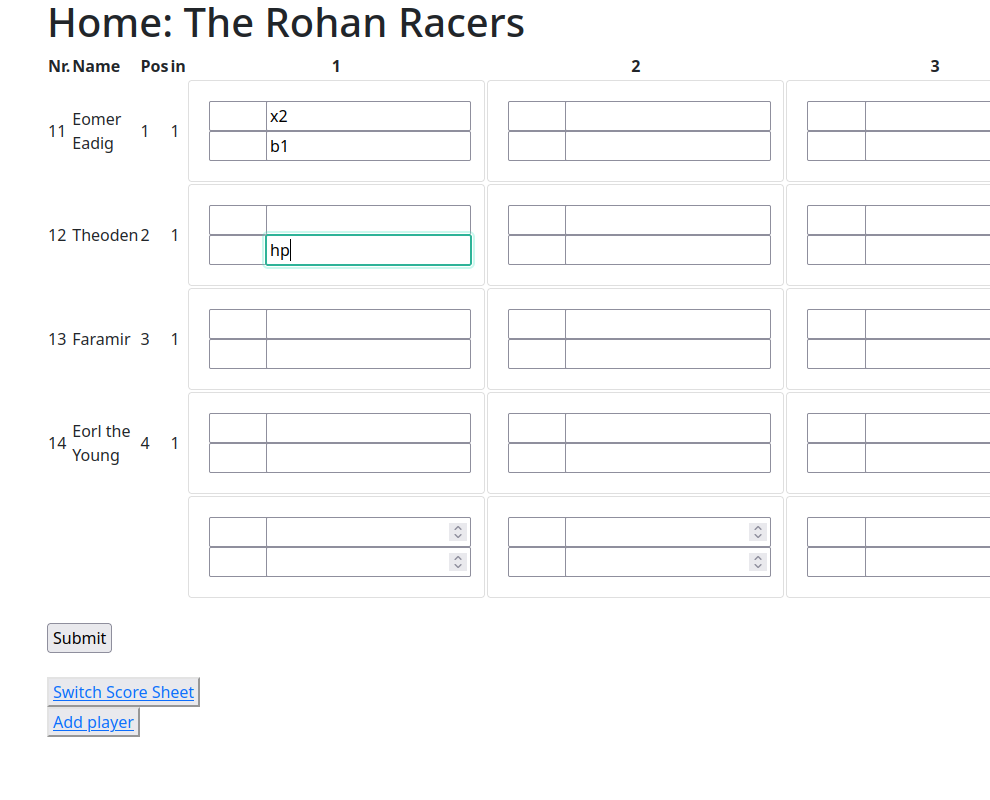

# Electronic Scorer Sheet
## Run server
From Electronic-Scorer-Sheet root type in console:

```shell
python manage.py runserver
```

## Usage
After logging in, we see a list of created games. 
By clicking on one of the team names, we access on the scoring board for said team.

### Navigation bar and home screen
To directly go to places or log out.


To create a new game, click on _Create a new game_.


### Creating a new game
If the team you need is not yet created, you must do so by clicking on _Create a new team_.

After entering all the data for the game, continue by clicking on _OK_


You can either create the team by clicking on _Create team_, or cancel by clicking on _Get back_.


#### Create line-up
If the player is not on the DB yet, create it with _Add a new player_.

Once done, click on _Submit team_ to continue.


By clicking on _Add player_, you can continue to add players until you have introduced the all. 
Once done, get back by clicking on _Get back_.



### The Scoring board
Once you have introduced all data, you can begin to score. 
You can switch the score boards of the teams by clicking on _Switch Score Sheet_.

